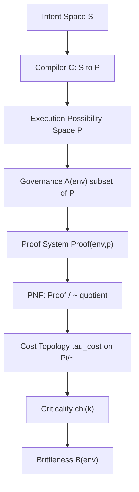

# EIAC Stratified Admissibility — Conceptual Spec v0.1

## Status

This document is **conceptual and non-normative**. It describes a theoretical
abstraction layer (EIAC / PNF / χ(k)) that does not currently connect to, depend
on, or modify any existing artifact in this repository — including
`docs/cvp-transition-spec-v1.2-to-v1.3.md`, `docs/simulation-os-kernel-reference-v0.5.md`,
`cvp_transition/`, or `invariants/`.

It is **read-only conceptual material**: nothing here is wired into the gate
validator, the witness schema, or the invariant registry. It should not be
treated as a numbered continuation of any other spec in this repo (there is no
existing §1–§25 elsewhere that this extends). If and when any part of this is
promoted into implementation, that should happen as an explicit, separate
follow-up decision — not implied by this document's existence.

Out of scope for this version: any execution-semantics or monitoring layer
(e.g. GateStatus/Reasons, hash-drift detection). That is downstream of this
abstraction and is intentionally not addressed here.

## 1. Purpose

EIAC (Environment-Indexed Admissibility Closure) models admissibility not as a
flat boolean filter but as a layered geometric object: a quotient space of
proofs, a cost topology over that quotient, and a criticality operator that
identifies where the admissibility space is smooth versus where it fractures
into discontinuous strata.

## 2. Layered Architecture

Each layer below is a *view* over a fixed object space, not an execution
stage. Arrows indicate dependency direction only.

### L0 — Source / Intent Space

```
S  (Programs / IntentTransactions)
```

Structured intent with no semantics attached yet.

### L1 — Deterministic Compilation

```
C : S -> P ∪ {fail}
```

Pure structural translation from intent to the space of possible execution
artifacts `P` (e.g. execution packets, plan DAGs, external ops). No
admissibility decisions and no governance happen at this layer.

### L2 — Governance Filter (EIAC index layer)

```
A(env) ⊆ P
A(env) = (⋂ₐ lift_a(A_a(π_a(env)))) ∩ X(env)
```

- `A_a` — adapter-local admissibility predicates
- `π_a` — projection maps from the global environment to adapter-local views
- `X(env)` — coupling closure: a K-typed witness system joining adapter
  constraints together

This layer is a **set restriction operator** on `P` — it does not evaluate or
execute anything, it only carves out the admissible subset `P_env ⊆ P`.

### L3 — Proof-Carrying Layer

```
Proof(env, p) ⇔ (env, p) ∈ A
Extract(env, p) -> Proof ∪ {⊥}
```

Admissibility is restated as certificate existence:

```
A(env) ≡ ∃ Proof(env, p)
```

A proof decomposes into local adapter proofs (`Π_local`), coupling witnesses
(`Π_couple`), and a recomposition trace (`Π_glue`). "Allowed" means
"derivable," not "approved by a gate."

### L4 — Proof Normalization (PNF)

```
PNF : Proof -> Proof*
```

Proofs are quotiented by an equivalence relation (`Π / ~`) and reduced to a
canonical, cost-minimal representative per equivalence class. PNF is
idempotent and deterministic, and operates purely on proof structure — it
never reads or rewrites `A(env)`.

### L5 — Cost Topology

```
(Π/~, τ_cost)
```

The quotient space of proofs is given a topology induced by normalization
cost: proximity reflects structural similarity of proofs, and continuity
reflects small structural edits. This is what makes "deformation" and
"minimization" meaningful concepts over proofs.

### L6 — Criticality Layer (χ)

```
χ(k) ∈ {0, 1}      for each constraint k
X(env) = ⋂ₖ X_k(env)
B(env) = Σₖ w_k · χ(k)
```

- `χ(k) = 0` — constraint `k` is topology-preserving (smooth, continuous
  region of admissibility space)
- `χ(k) = 1` — constraint `k` is a phase-transition generator (introduces a
  discontinuity / singular stratum)
- `B(env)` — brittleness: the weighted count of singular-stratum generators
  active for a given environment, not a probabilistic risk score

This layer only observes the topology (`τ_cost`) produced by L5. It has no
ability to affect `A(env)` or proof validity — it purely classifies the
geometric stability of the admissibility space that L2–L4 already produced.

## 3. Dependency Graph

```
S
↓ compile
P
↓ restrict
A(env)            (governance / EIAC)
↓ certify
Proof(env, p)     (v1.7-style proof system)
↓ quotient
Π/~               (PNF canonical forms)
↓ topologize
(Π/~, τ_cost)     (cost topology)
↓ classify
χ(k), B(env)      (criticality / brittleness)
```



## 4. Boundary Invariants

These must hold for the layering to remain meaningful:

- **No upward leakage** — `χ(k)` cannot affect proof validity; PNF cannot
  change `A(env)`; governance cannot reinterpret compilation (`C`).
- **No downward retrocausality** — proofs cannot change compilation
  semantics; EIAC cannot rewrite `P`; topology cannot redefine the K-witness
  system.
- **No hidden interpreter layer** — every layer here is either a function on
  a fixed space, or a quotient/topology defined over that space. None of them
  is a decision engine.

## 5. One-Sentence System Identity

A stratified admissibility system where compilation generates a fixed
possibility space, governance carves out admissible subsets, proofs certify
membership in that subset, normalization quotients the resulting proof
fibers, and topology plus criticality classify the structural stability of
the resulting quotient geometry.

## 6. Explicitly Not Covered Here

- Execution-semantics / monitoring layer (GateStatus, Reasons, hash-drift
  detection) — intentionally deferred, not part of this abstraction.
- Any wiring into `cvp_transition/gates.py`, the invariant registry, or the
  witness schema.
- A formal coupling structure between multiple `χ(k)` generators (a "phase
  interaction graph") — noted as a natural next object if this layer is ever
  extended, but not defined in this version.
